# 循环神经网络RNN

## 1 RNN介绍

### 1.1 RNN概念

循环神经网络（Recurrent Neural Network, RNN）是一种==专门处理序列数据的神经网络==。与传统的前馈神经网络不同，RNN具有“**循环**”结构，能够处理和记住前面时间步的信息，使其特别适用于时间序列数据或有时序依赖的任务。

我们要明确什么是序列数据，时间序列数据是指在不同时间点上收集到的数据，这类数据反映了某一事物、现象等随时间的变化状态或程度。这是时间序列数据的定义，当然这里也可以不是时间，比如文字序列，但总归序列数据有一个特点——**后面的数据跟前面的数据有关系**。

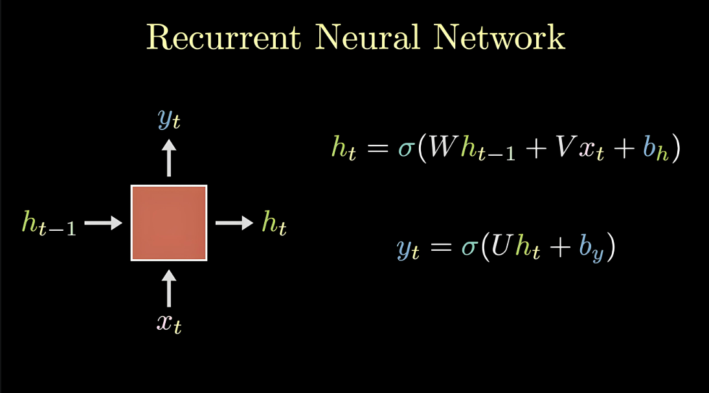

### 1.2 RNN应用场景

- **自然语言处理（NLP）**：文本生成、语言建模、机器翻译、情感分析等。
- **时间序列预测**：股市预测、气象预测、传感器数据分析等。
- **语音识别**：将语音信号转换为文字。
- **音乐生成**：通过学习音乐的时序模式来生成新乐曲。

### 1.3 自然语言处理概述

自然语言处理（Nature language Processing, NLP）研究的主要是==通过计算机算法来理解自然语言。==

对于自然语言来说，处理的数据主要就是**人类的语言**，例如：汉语、英语、法语等，该类型的数据不像我们前面接触过的结构化数据、或者图像数据可以很方便的进行数值化。

NLP的目标是让机器能够“听懂”和“读懂”自然语言，并进行有效的交流和分析。

NLP涵盖了从文本到语音、从语音到文本的各个方面，它涉及多种技术，包括语法分析、语义理解、情感分析、机器翻译等。

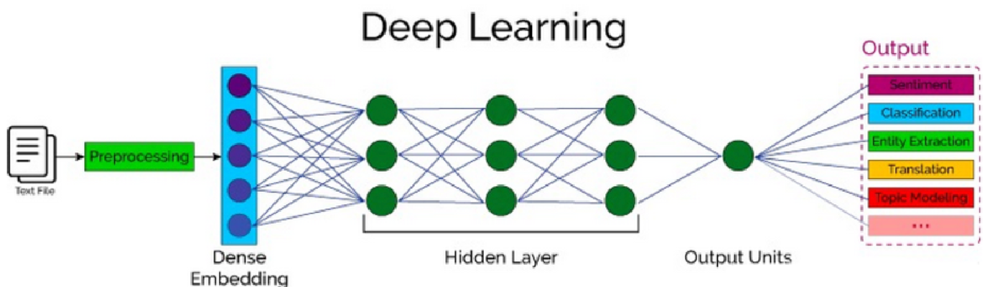

## 2 词嵌入层

> 在 **RNN（Recurrent Neural Network）** 中，**词嵌入层（Word Embedding Layer）** 是处理自然语言数据的关键组成部分。它将输入的离散单词（通常是词汇表中的索引）转换为连续的、低维的向量表示，从而使得神经网络能够理解和处理这些词汇的语义信息。

### 2.1 词嵌入层作用

词嵌入层的主要目的是**将每个词映射为一个固定长度的向量（将文本转换为向量）**，这些向量能够捕捉词与词之间的语义关系。

传统的文本表示方法（如one-hot编码）无法反映单词之间的相似性，因为在one-hot编码中，每个单词都被表示为一个**高维稀疏向量**，而词嵌入通过**低维稠密向量**表示单词，能够更好地捕捉词汇之间的语义相似性。

词嵌入层首先会根据输入的词的数量构建一个**词向量矩阵**，例如: 我们有 100 个词，每个词希望转换成 128 维度的向量，那么构建的矩阵形状即为: 100*128，输入的每个词都对应了一个该矩阵中的一个向量。

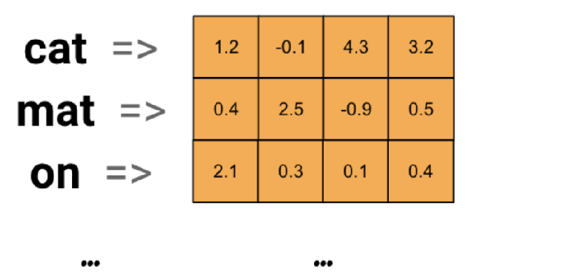

**词嵌入层在RNN中的作用**：

- **输入表示**：RNN通常用于处理序列数据。在处理文本时，RNN的输入是由单词构成的序列。由于神经网络不能直接处理离散的单词标识符（如整数索引或字符），因此需要通过词嵌入层将每个单词转换为一个固定长度的稠密向量。这些向量作为RNN的输入，帮助RNN理解词语的语义。
- **降低维度**：词嵌入层将原本高维的稀疏表示（如one-hot编码）转化为低维的稠密向量，减少了计算量，同时保持了词汇之间的语义关系。
- **捕捉语义相似性**：通过训练，词嵌入能够学习到词语之间的关系。例如，语义相似的词（如“猫”和“狗”）在向量空间中会比较接近，而语义不相关的词（如“猫”和“汽车”）则会较为遥远。

### 2.2 词嵌入层工作流程

- **初始化词向量**：词嵌入层的初始词向量通常会使用随机初始化或者通过加载预训练的词向量（如Word2Vec或GloVe）进行初始化。

- **输入索引**：每个单词在词汇表中都有一个唯一的索引。输入文本（例如一个句子）会先被分词，然后每个单词会被转换为相应的索引。

- **查找词向量**：词嵌入层将这些单词索引映射为对应的词向量。这些词向量是一个低维稠密向量，表示该词的语义。

- **输入到RNN**：这些词向量作为RNN的输入，RNN处理它们并根据上下文生成一个序列的输出。

### 2.3 词嵌入层使用

在PyTorch中，我们可以**使用 nn.Embedding 词嵌入层来实现输入词的向量化**。

nn.Embedding 对象构建时，最主要有两个参数:

- num_embeddings：表示**词的数量**

- embedding_dim：表示**用多少维的向量来表示每个词**

```python
nn.Embedding(num_embeddings=10, embedding_dim=4)
```

接下来，我们将会学习如何将词转换为词向量，其步骤如下:

1. 先将语料进行分词，构建词与索引的映射，我们可以把这个映射叫做词表，词表中每个词都对应了一个唯一的索引；
2. 然后使用 nn.Embedding 构建词嵌入矩阵，词索引对应的向量即为该词对应的数值化后的向量表示。

例如，我们的文本数据为: "北京冬奥的进度条已经过半，不少外国运动员在完成自己的比赛后踏上归途。"，接下来，我们看下如何使用词嵌入层将其进行转换为向量表示，步骤如下：

```python
import torch
import torch.nn as nn
import jieba # pip install jieba -i https://pypi.mirrors.ustc.edu.cn/simple/


if __name__ == '__main__':
    # 0.文本数据
    text = '北京冬奥的进度条已经过半，不少外国运动员在完成自己的比赛后踏上归途。'
    # 1. 文本分词
    words = jieba.lcut(text)
    print('文本分词:', words)
    # 2.分词去重并保留原来的顺序获取所有的词语
    unique_words = list(set(words))
    print("去重后词的个数:\n",len(unique_words))
    # 3. 构建词嵌入层
    # num_embeddings: 表示词的总数量
    # embedding_dim: 表示词嵌入的维度
    embed = nn.Embedding(num_embeddings=len(unique_words), embedding_dim=4)
    print("词嵌入的结果：\n",embed)
    # 4. 词语的词向量表示
    for i, word in enumerate(unique_words):
        # 获得词嵌入向量
        word_vec = embed(torch.tensor(i))
        print('%s\t' % word, word_vec)
```

**输出结果：**

```python
文本分词: ['北京', '冬奥', '的', '进度条', '已经', '过半', '，', '不少', '外国', '运动员', '在', '完成', '自己', '的', '比赛', '后', '踏上', '归途', '。']
去重后词的个数:
 18
词嵌入的结果：
 Embedding(18, 4)
 北京	 tensor([-1.8043,  1.7860, -0.7821, -0.3167], grad_fn=<EmbeddingBackward0>)
  的	 tensor([-1.4856, -0.5639,  0.2745,  0.1087], grad_fn=<EmbeddingBackward0>)
 冬奥	 tensor([ 0.6969, -0.5615,  1.6524, -0.2651], grad_fn=<EmbeddingBackward0>)
 自己	 tensor([1.7163, 0.9710, 0.0193, 1.4562], grad_fn=<EmbeddingBackward0>)
 不少	 tensor([ 0.8770, -1.0347,  0.4939,  1.6718], grad_fn=<EmbeddingBackward0>)
 归途	 tensor([ 0.0619,  0.0355, -1.6510,  0.8121], grad_fn=<EmbeddingBackward0>)
 比赛	 tensor([-1.7128,  0.0681,  2.4199,  0.2714], grad_fn=<EmbeddingBackward0>)
进度条	 tensor([-0.6706,  0.4089, -0.5371,  0.1093], grad_fn=<EmbeddingBackward0>)
 外国	 tensor([ 0.5665, -0.3168, -0.2065,  0.7682], grad_fn=<EmbeddingBackward0>)
 完成	 tensor([ 1.4640, -0.2800, -0.2242, -0.3790], grad_fn=<EmbeddingBackward0>)
 过半	 tensor([ 1.8026,  0.9831, -0.7177,  0.6779], grad_fn=<EmbeddingBackward0>)
 踏上	 tensor([-1.0745, -0.2610, -1.5350, -0.1767], grad_fn=<EmbeddingBackward0>)
运动员	 tensor([1.8748, 0.2093, 1.9471, 0.3893], grad_fn=<EmbeddingBackward0>)
  ，	 tensor([-1.2841, -0.0675, -0.1263, -0.6892], grad_fn=<EmbeddingBackward0>)
  在	 tensor([ 0.6202, -0.0106,  1.0504,  0.0299], grad_fn=<EmbeddingBackward0>)
 已经	 tensor([2.4461, 0.2113, 0.9387, 0.1680], grad_fn=<EmbeddingBackward0>)
  后	 tensor([-1.1989,  0.8727, -0.9484,  0.0578], grad_fn=<EmbeddingBackward0>)
  。	 tensor([0.4020, 0.7357, 0.3571, 1.2355], grad_fn=<EmbeddingBackward0>)
```

## 3 循环网络层

文本数据是具有序列特性的，例如: "我爱你", 这串文本就是具有序列关系的，"爱" 需要在 "我" 之后，"你" 需要在 "爱" 之后, 如果颠倒了顺序，那么可能就会表达不同的意思。

为了表示出数据的序列关系，我们需要使用循环神经网络(Recurrent Nearal Networks, RNN) 来对数据进行建模，RNN 是一个具有记忆功能的网络，它作用于处理带有序列特点的样本数据。

### 3.1 RNN网络层原理

当我们希望使用循环网络来对 "我爱你" 进行语义提取时，RNN计算过程是什么样的呢？

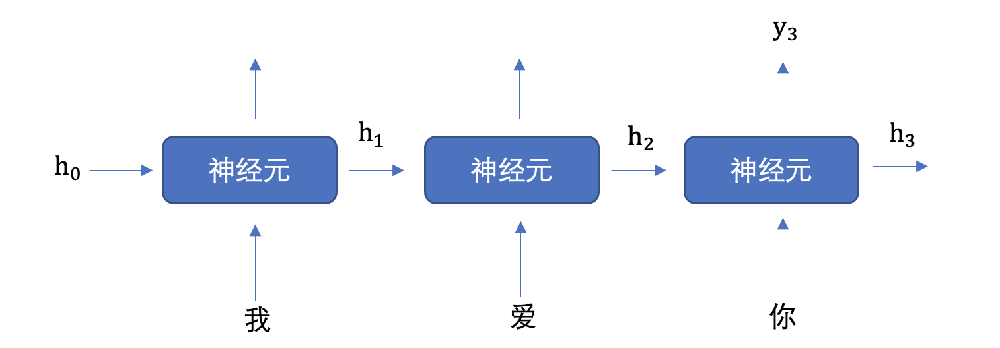

上图中h表示==隐藏状态==，隐藏状态保存了**序列数据中的历史信息**，并将这些信息传递给下一个时间步，从而允许RNN处理和预测序列数据中的元素。

每一次的输入都会包含两个值：**上一个时间步的隐藏状态、当前状态的输入值x**

每一次的输出都会包含两个值：**输出当前时间步的隐藏状态、当前时间步的预测结果y**

**隐藏状态作用：**

- **记忆功能**：隐藏状态就像RNN的记忆，它能够在不同的时间步之间传递信息。当一个新的输入进入网络时，当前的隐藏状态会结合这个新输入来生成新的隐藏状态。

- **上下文理解**：由于隐藏状态携带了过去的信息，它可以用于理解和生成与上下文相关的输出。这对于语言模型、机器翻译等任务尤其重要。

- **连接不同时间步**：隐藏状态通过网络内部的循环连接将各个时间步连接起来，使得网络可以处理变长的序列数据。

上图中，为了更加容易理解，虽然画了 3 个神经元, 但是实际上只有一个神经元，"我爱你" 三个字是重复输入到同一个神经元中。


我们举个例子来理解上图的工作过程，假设我们要实现文本生成，也就是输入 "我爱" 这两个字，来预测出 "你"，其如下图所示:

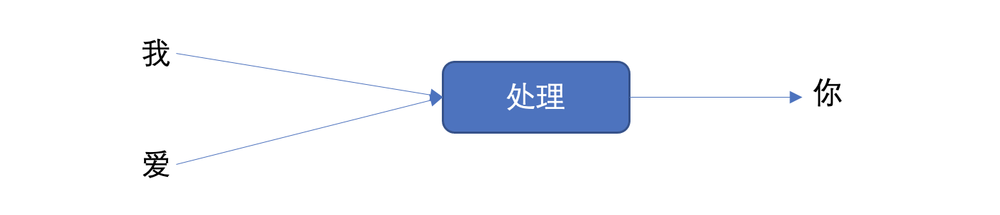

将上图展开成不同时间步的形式，如下图所示:

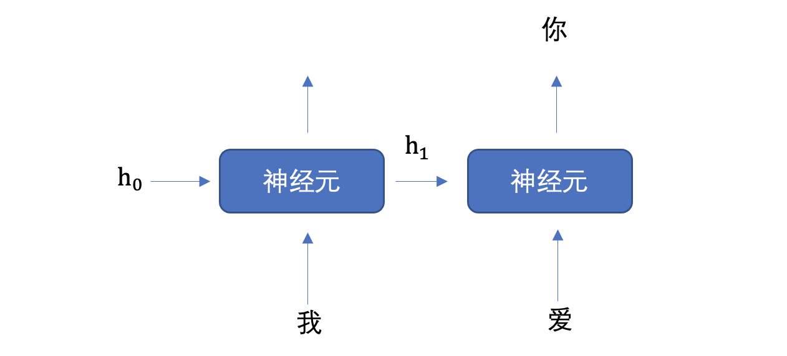

首先初始化出第一个隐藏状态，一般都是全0的一个向量，然后将 "我" 进行词嵌入，转换为向量的表示形式，送入到第一个时间步，然后输出隐藏状态 h1，然后将 h1 和 "爱" 输入到第二个时间步，得到隐藏状态 h2, 将 h2 送入到全连接网络，得到 "你" 的预测概率。

**RNN神经元内部是如何计算的呢？**

**1. 计算隐藏状态：**每个时间步的隐藏状态$$h_t$$是根据当前输入$$x_t$$和前一时刻的隐藏状态$$h_{t-1}$$计算的。


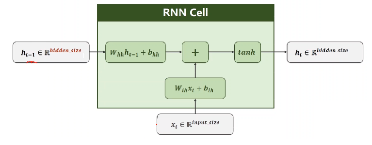

上述公式中:

- $$W_{ih}$$ 表示输入数据的权重
- $$b_{ih}​$$ 表示输入数据的偏置
- $$W_{hh}​$$ 表示输入隐藏状态的权重
- $$b_{hh}$$ 表示输入隐藏状态的偏置
- $$h_{t-1}$$ 表示输入隐藏状态
- $$h_t​$$ 表示输出隐藏状态

最后对输出的结果使用tanh激活函数进行计算，得到该神经元你的输出隐藏状态。

**2. 计算当前时刻的输出：**网络的输出$$y_t$$是当前时刻的隐藏状态经过一个线性变换得到的。

​			$$y_t=W_{hy}h_t+b_y​$$

- $$y_t​$$ 是当前时刻的输出（通常是一个向量，表示当前时刻的预测值，RNN层的预测值）
- $$h_t​$$ 是当前时刻的隐藏状态
- $$W_{hy}$$ 是从隐藏状态到输出的权重矩阵
- $$b_y$$ 是输出层的偏置项

**3. 词汇表映射**：输出$$y_t$$是一个**向量**，该向量经过**全连接层**后输出得到最终预测结果$$y_{pred}$$，$$y_{pred}$$中每个元素代表当前时刻生成词汇表中某个词的得分（或概率，通过激活函数：如**softmax**）。==词汇表有多少个词，$$y_{pred}$$就有多少个元素值，最大元素值对应的词就是当前时刻预测生成的词。==


**神经元工作机制总结：**

- **接收输入**：每个RNN神经元接收来自输入数据$$x_t$$和前一时刻的隐藏状态$$h_{t-1}$$。

- **更新隐藏状态**：神经元通过一个加权和（由权重矩阵和偏置项组成）更新当前时刻的隐藏状态$$h_t​$$，该隐藏状态包含了来自过去的记忆以及当前输入的信息。

- **输出计算**：基于当前隐藏状态$$h_t​$$，神经元生成当前时刻的输出$$y_t​$$，该输出可以用于任务的最终预测。

  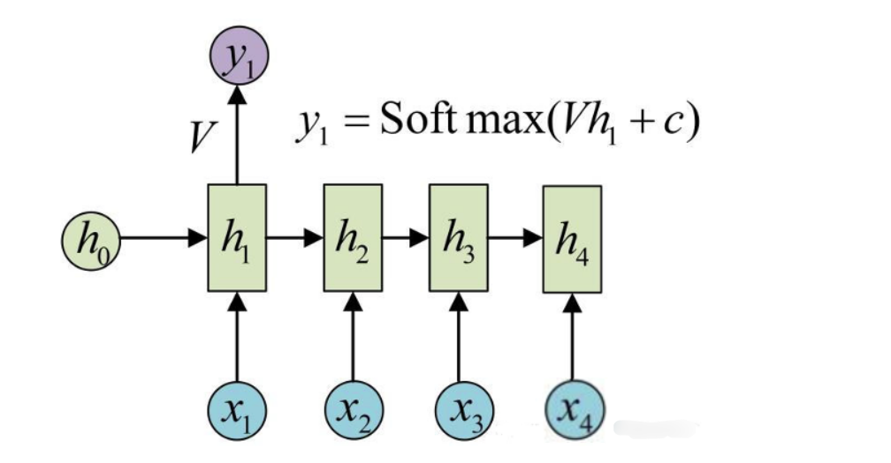

  

**文本生成示例：**

假设我们使用RNN进行**文本生成**，输入是一个初始词语或一段上下文（例如，“m”）。RNN会通过隐藏状态逐步生成下一个词的概率分布，然后根据概率选择最可能的下一个词。

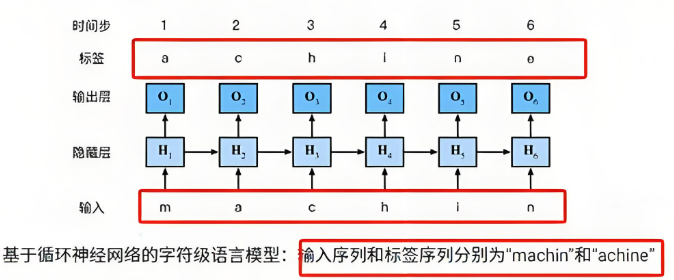

1. 输入：“m” → 词向量输入$$x_1$$（对应“m”）

2. 初始化隐藏状态$$h_0​$$，一般初始值为0

3. 隐藏状态更新$$h_1​$$，并计算输出$$y_1​$$

4. 经过全连接层输出层计算输出$$y_{pred}​$$，使用softmax函数将$$y_{pred}​$$转换为概率分布

5. 选择概率最高的词作为输出词（例如“a”）

6. 输入新的词“a”，继续处理下一个时间步，直到生成完整的词或句子

   

**小结：**在循环神经网络中，**词与输出的对应关系**通常通过以下几个步骤建立

1. **词嵌入**：将词转化为向量表示（词向量）。
2. **RNN处理**：通过RNN层逐步处理词向量，生成每个时间步的隐藏状态。
3. **输出映射**：通过线性变换将隐藏状态映射到输出，通常是一个词汇表中的词的概率分布。

### 3.2 PyTorch RNN层的使用

- API介绍

  ```python
  RNN = nn.RNN(input_size, hidden_size，num_layers)
  ```

  参数意义是：

  - input_size：输入数据的维度，一般设为词向量的维度
  - hidden_size：隐藏层h的维度，也是当前层神经元的输出维度
  - num_layers: 隐藏层h的层数，默认为1

- 输入数据和输出结果

  将RNN实例化就可以将数据送入其中进行处理，处理的方式如下所示：

  ```python
  output, hn = RNN(x, h0)
  ```

  - **输入数据：主要包括词嵌入的x 、初始的隐藏层h0**
    - x的表示形式为[seq_len, batch, input_size]，即[句子的长度，batch的大小，词向量的维度]
    - h0的表示形式为[num_layers, batch, hidden_size]，即[隐藏层的层数，batch的大小，隐藏层h的维度]
  - **输出结果：主要包括输出结果output,最后一层的hn**
    - output的表示形式与输入x类似，为[seq_len, batch, input_size]，即[句子的长度，batch的大小，输出向量的维度]
    - hn的表示形式与输入h0一样，为[num_layers, batch, hidden_size]，即[隐藏层的层数，batch的大，隐藏层h的维度]

- API使用

  ```python
  import torch
  import torch.nn as nn
  
  
  #  RNN层送入批量数据
  def test():
      # 词向量维度 128, 隐藏向量维度 256
      rnn = nn.RNN(input_size=128, hidden_size=256)
      # 第一个数字: 表示句子长度,也就是词语个数
      # 第二个数字: 批量个数，也就是句子的个数
      # 第三个数字: 词向量维度
      inputs = torch.randn(5, 32, 128)
      hn = torch.zeros(1, 32, 256)
      # 获取输出结果
      output, hn = rnn(inputs, hn)
      print("输出向量的维度：\n",output.shape)
      print("隐藏层输出的维度：\n",hn.shape)
  
      
  if __name__ == '__main__':
      test()
  ```

  **输出结果：**

  ```python
  输出向量的维度：
   torch.Size([5, 32, 256])
  隐藏层输出的维度：
   torch.Size([1, 32, 256])
  ```

## 4 文本生成案例

文本生成任务是一种常见的自然语言处理任务，输入一个开始词能够预测出后面的词序列。本案例将会使用循环神经网络来实现周杰伦歌词生成任务。


### 4.1 导入工具包

```python
import torch
import jieba
from torch.utils.data import DataLoader
import torch.nn as nn
import torch.optim as optim
import time
```

### 4.2 数据集

我们收集了周杰伦从第一张专辑《Jay》到第十张专辑《跨时代》中的歌词，来训练神经网络模型，当模型训练好后，我们就可以用这个模型来创作歌词。数据集如下：

```python
想要有直升机
想要和你飞到宇宙去
想要和你融化在一起
融化在宇宙里
我每天每天每天在想想想想著你
这样的甜蜜
让我开始相信命运
感谢地心引力
让我碰到你
漂亮的让我面红的可爱女人
...
```

该数据集共有 5819 行文本。

### 4.3 构建词表

在进行自然语言处理任务之前，首要做的就是构建词表。

所谓的词表就是将语料进行分词，然后给每一个词分配一个唯一的编号，便于我们送入词嵌入层。

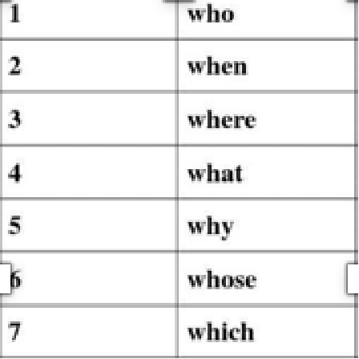

接下来, 我们对周杰伦歌词的数据进行处理构建词表，具体流程如下：

- 获取文本数据
- 分词，并进行去重
- 构建词表

```python
# 获取数据，并进行分词，构建词表
def build_vocab():
    # 数据集位置
    file_name = 'data/jaychou_lyrics.txt'
    # 分词结果存储位置
    # 唯一词列表
    unique_words = []
    # 每行文本分词列表
    all_words = []
    # 遍历数据集中的每一行文本
    for line in open(file_name, 'r', encoding='utf-8'):
        # 使用jieba分词,分割结果是一个列表
        words = jieba.lcut(line)
        # print(words)
        # 所有的分词结果存储到all_words，其中包含重复的词组
        all_words.append(words)
        # 遍历分词结果，去重后存储到unique_words
        for word in words:
            if word not in unique_words:
                unique_words.append(word)
    # 语料中词的数量
    word_count = len(unique_words)
    # 词到索引映射
    word_to_index = {word: idx for idx, word in enumerate(unique_words)}
    # 歌词文本用词表索引表示
    corpus_idx = []
    # 遍历每一行的分词结果
    for words in all_words:
        temp = []
        # 获取每一行的词，并获取相应的索引
        for word in words:
            temp.append(word_to_index[word])
        # 在每行词之间添加空格隔开
        temp.append(word_to_index[' '])
        # 获取当前文档中每个词对应的索引
        corpus_idx.extend(temp)
    return unique_words, word_to_index, word_count, corpus_idx


if __name__ == "__main__":
    # 获取数据
    unique_words, word_to_index, unique_word_count, corpus_idx = build_vocab()
    print("词的数量：\n",unique_word_count)
    print("去重后的词:\n",unique_words)
    print("每个词的索引：\n",word_to_index)
    print("当前文档中每个词对应的索引：\n",corpus_idx)
```

我们的词典主要包含了:

- unique_words: 存储了每个词

- word_to_index: 存储了词到编号的映射

  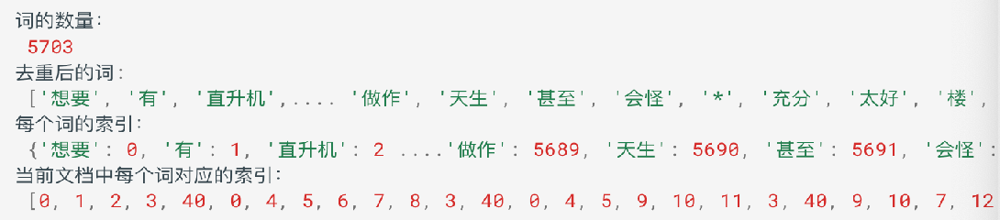

### 4.4 构建数据集对象

我们在训练的时候，为了便于读取语料，并送入网络，所以我们会构建一个Dataset对象

```python
class LyricsDataset(torch.utils.data.Dataset):
	def __init__(self, corpus_idx, num_chars):
		# 文档数据中词的索引
		self.corpus_idx = corpus_idx
		# 每个句子中词的个数
		self.num_chars = num_chars
		# 文档数据中词的数量，不去重
		self.word_count = len(self.corpus_idx)
		# 句子数量
		self.number = self.word_count // self.num_chars

	# len(obj)时自动调用此方法
	def __len__(self):
		# 返回句子数量
		return self.number

	# obj[idx]时自动调用此方法
	def __getitem__(self, idx):
		# idx指词的索引，并将其修正索引值到文档的范围里面
		"""
		我 爱你 中国 , 亲爱 的 母亲
		word_count: 7
		num_chars: 2 一个句子由num_chars个词组成
		word_count-num_chars-2: 7-2-1=4  -1:网络预测结果y在x上后移一个词取值-1
		idx=5->start=4
		"""
		start = min(max(idx, 0), self.word_count - self.num_chars - 1)
		end = start + self.num_chars
		# 输入值
		x = self.corpus_idx[start: end]
		# 网络预测结果（目标值）
		y = self.corpus_idx[start + 1: end + 1]
		# 返回结果
		return torch.tensor(x), torch.tensor(y)


if __name__ == "__main__":
	# 获取数据
	unique_words, word_to_index, unique_word_count, corpus_idx = build_vocab()
	# 数据获取实例化
	dataset = LyricsDataset(corpus_idx, 5)
	# 查看句子数量
	print('句子数量：', len(dataset))
	# x, y = dataset.__getitem__(0)
	x, y = dataset[0]
	print("网络输入值：", x)
	print("目标值：", y)
```

**输出结果：**

```python
句子数量： 9827
网络输入值： tensor([ 0,  1,  2,  3, 40])
目标值： tensor([ 1,  2,  3, 40,  0])
```

### 4.5 构建网络模型

我们用于实现《歌词生成》的网络模型，主要包含了三个层:

- 词嵌入层: 用于将语料转换为词向量

- 循环网络层: 提取句子语义

- 全连接层: 输出对词典中每个词的预测概率

```python
# 模型构建
class TextGenerator(nn.Module):
    def __init__(self, unique_word_count):
        super(TextGenerator, self).__init__()
        # 初始化词嵌入层: 语料中词的数量, 词向量的维度为128
        self.ebd = nn.Embedding(unique_word_count, 128)
        # 循环网络层: 词向量维度128, 隐藏向量维度256, 网络层数1
        self.rnn = nn.RNN(128, 256, 1)
        # 输出层: 特征向量维度256与隐藏向量维度相同, 词表中词的个数
        self.out = nn.Linear(256, unique_word_count)
        
    def forward(self, inputs, hidden):
        # 输出维度: (batch, seq_len, 词向量维度128)
        # batch：句子数量
        # seq_len： 句子长度， 每个句子由多少个词 词数量
        embed = self.ebd(inputs)
        # rnn层x的表示形式为(seq_len, batch, 词向量维度128)
        # output的表示形式与输入x类似，为(seq_len, batch, 词向量维度256)
        # 前后的hidden形状要一样, 所以DataLoader加载器的batch数要能被整数
        output, hidden = self.rnn(embed.transpose(0, 1), hidden)
        # 全连接层输入二维数据， 词数量*词维度
        # 输入维度: (seq_len*batch, 词向量维度256) 
        # 输出维度: (seq_len*batch, 语料中词的数量)
        # output: 每个词的分值分布，后续结合softmax输出概率分布
        output = self.out(output.reshape(shape=(-1, output.shape[-1])))
        # 网络输出结果
        return output, hidden
    
    def init_hidden(self, bs):
        # 隐藏层的初始化:[网络层数, batch, 隐藏层向量维度]
        return torch.zeros(1, bs, 256)
    
    
if __name__ == "__main__":
	# 获取数据
	unique_words, word_to_index, unique_word_count, corpus_idx = build_vocab()
	model = TextGenerator(unique_word_count)
	for named, parameter in model.named_parameters():
		print(named)
		print(parameter)
```

### 4.6 构建训练函数

前面的准备工作完成之后, 我们就可以编写训练函数。训练函数主要负责编写数据迭代、送入网络、计算损失、反向传播、更新参数，其流程基本较为固定。

由于我们要实现文本生成，文本生成本质上，输入一串文本，预测下一个文本，也属于分类问题，所以，我们使用多分类交叉熵损失函数。优化方法我们学习过 SGB、AdaGrad、Adam 等，在这里我们选择学习率、梯度自适应的 Adam 算法作为我们的优化方法。

训练完成之后，我们使用 torch.save 方法将模型持久化存储。

```python
def train():
	# 构建词典
	unique_words, word_to_index, unique_word_count, corpus_idx = build_vocab()
	# 数据集 LyricsDataset对象，并实现了 __getitem__ 方法
	lyrics = LyricsDataset(corpus_idx=corpus_idx, num_chars=32)
	# 查看句子数量
	# print(lyrics.number)
	# 初始化模型
	model = TextGenerator(unique_word_count)
	# 数据加载器 DataLoader对象，并将lyrics dataset对象传递给它
	lyrics_dataloader = DataLoader(lyrics, shuffle=True, batch_size=5)
	# 损失函数
	criterion = nn.CrossEntropyLoss()
	# 优化方法
	optimizer = optim.Adam(model.parameters(), lr=1e-3)
	# 训练轮数
	epoch = 10
	for epoch_idx in range(epoch):
		# 训练时间
		start = time.time()
		iter_num = 0  # 迭代次数
		# 训练损失
		total_loss = 0.0
		# 遍历数据集 DataLoader 会在后台调用 dataset.__getitem__(index) 来获取每个样本的数据和标签，并将它们组合成一个 batch
		for x, y in lyrics_dataloader:
			# 隐藏状态的初始化
			hidden = model.init_hidden(bs=5)
			# 模型计算
			output, hidden = model(x, hidden)
			# 计算损失
			# y形状为(batch, seq_len), 需要转换成一维向量->160个词的下标索引
            # output形状为(seq_len, batch, 词向量维度)
            # 需要先将y进行维度交换(和output保持一致)再改变形状
            y = torch.transpose(y, 0, 1).reshape(shape=(-1,))
			loss = criterion(output, y)
			optimizer.zero_grad()
			loss.backward()
			optimizer.step()
			iter_num += 1  # 迭代次数加1
			total_loss += loss.item()
		# 打印训练信息
		print('epoch %3s loss: %.5f time %.2f' % (epoch_idx + 1, total_loss / iter_num, time.time() - start))
	# 模型存储
	torch.save(model.state_dict(), 'model/lyrics_model_%d.pth' % epoch)

    
if __name__ == "__main__":
	train()
```

**输出结果：**

```python
epoch   1 loss: 1.84424 time 5.75
epoch   2 loss: 0.21154 time 5.91
epoch   3 loss: 0.12014 time 5.85
epoch   4 loss: 0.10625 time 5.73
epoch   5 loss: 0.10226 time 5.58
epoch   6 loss: 0.10009 time 5.65
epoch   7 loss: 0.09942 time 5.66
epoch   8 loss: 0.09783 time 5.66
epoch   9 loss: 0.09663 time 5.75
epoch  10 loss: 0.09568 time 5.77
```

### 4.7 构建预测函数

从磁盘加载训练好的模型，进行预测。预测函数，输入第一个指定的词，我们将该词输入网路，预测出下一个词，再将预测的出的词再次送入网络，预测出下一个词，以此类推，知道预测出我们指定长度的内容。

```python
def predict(start_word, sentence_length):
    # 构建词典
    unique_words, word_to_index, unique_word_count, _ = build_vocab()
    # 构建模型
    model = TextGenerator(unique_word_count)
    # 加载参数
    model.load_state_dict(torch.load('model/lyrics_model_10.pth'))
    # 隐藏状态
    hidden = model.init_hidden(bs=1)
    # 将起始词转换为索引
    word_idx = word_to_index[start_word]
    # 产生的词的索引存放位置
    generate_sentence = [word_idx]
    # 遍历到句子长度，获取每一个词
    for _ in range(sentence_length):
        # 模型预测
        output, hidden = model(torch.tensor([[word_idx]]), hidden)
        # 获取预测结果
        word_idx = torch.argmax(output)
        generate_sentence.append(word_idx)
        # 根据产生的索引获取对应的词，并进行打印
    for idx in generate_sentence:
        print(unique_words[idx], end='')
        
        
if __name__ == '__main__':
    # 调用预测函数
    predict('分手', 50)
```

**输出结果：**

```python
分手的话像语言暴力
 我已无能为力再提起 决定中断熟悉
 周杰伦 周杰伦
 一步两步三步四步望著天 看星星
 一颗两颗三颗四颗 连成线背著背默默许下心愿
 看远方的星
```

